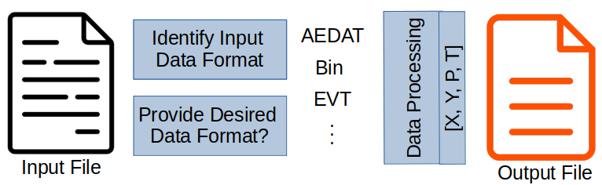
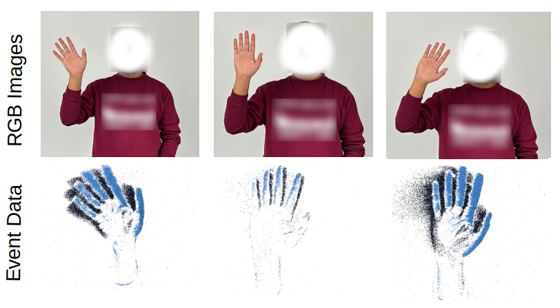

# Event Data Processing Pipeline
Welcome to the official repository of the Event Data Processing Pipeline! This hub is dedicated to converting event data from one format to another, streamlining your data processing tasks. Whether you're dealing with a single file or a batch, this repository provides the necessary tools and access to a wealth of open-source datasets.

# EventConversion_pipeline
The EventConversion_pipeline folder is equipped with Python scripts specifically designed for event data conversion between various formats. We are actively updating and optimizing the conversion files.

## How to Use:
To utilize a conversion script, you need to provide the paths for the input file and the desired output file. For EVT2 and EVT3 encoding, make sure to compile cpp_sample by using the `compile_cpp_with_python.py` script.
Once the paths are specified, the script automatically processes the data, ensuring the converted file is saved to your designated location.

#### Comparison with existing solutions:

|            | Npz | Aedat 2 | Aedat 3.1 | Aedat 4 | Bin | Csv | EVT 2 | EVT 3 |
|------------|-----|---------|-----------|---------|-----|-----|-------|-------|
| Aermanager | ✔   | x       | ✔         | ✔       | ✔   | x   | x     | x     |
| Aedat      | x   | x       | x         | ✔       | x   | x   | x     | x     |
| Tonic      | ✔   | ✔       | ✔         | ✔       | ✔   | ✔   | x     | x     |
| SpikingJelly | ✔ | ✔       | ✔         | x       | ✔   | ✔   | x     | x     |
| This Work  | ✔   | ✔       | ✔         | x       | ✔   | ✔   | ✔     | ✔     |

#### Data handling capabilities of the proposed pipeline:

|            | Aedat2 | Aedat3.1 | Bin | Npz | Csv | EVT2 | EVT3 |
|------------|--------|----------|-----|-----|-----|------|------|
| Aedat 2    | -      | x        | ✔   | ✔   | ✔   | ✔    | ✔    |
| Aedat 3.1  | x      | -        | ✔   | ✔   | ✔   | ✔    | ✔    |
| Bin        | ✔      | ✔        | -   | ✔   | ✔   | ✔    | ✔    |
| Npz        | ✔      | ✔        | ✔   | -   | ✔   | ✔    | ✔    |
| Csv        | ✔      | ✔        | ✔   | ✔   | -   | ✔    | ✔    |
| EVT 2      | ✔      | ✔        | ✔   | ✔   | ✔   | -    | x    |
| EVT 3      | ✔      | ✔        | ✔   | ✔   | ✔   | x    | -    |

# Datasets
Dive into our collection of datasets in multiple formats, all converted using our robust processing pipeline. These datasets are available for your perusal and use through the Google Drive link provided below.

Google Drive Datasets Link: https://drive.google.com/drive/folders/1kOeizXQvTG6lxz6_OLGBRMWnGCy9j_7F?usp=sharing

| Index | Dataset       | Recognition | Data Format | # Samples | Size   | License    |
|-------|---------------|-------------|-------------|-----------|--------|------------|
| 1     | NMNIST        | Digit       | Binary      | 70,000    | 1.2 GB | CC 4.0     |
| 2     | N-Caltech101  | Object      | Binary      | 9,146     | 4.0 GB | CC 4.0     |
| 3     | Bullying10k   | Action      | Binary      | 10,000    | 47.5 GB| CC 4.0     |
| 4     | MNIST-DVS     | Digit       | AEDAT       | 60,000    | 3.72 GB| CC 4.0     |
| 5     | CIFAR10-DVS   | Image       | AEDAT       | 10,000    | 8.4 GB | CC 4.0     |
| 6     | DVS128Gesture | Gesture     | AEDAT       | 1,342     | 2.9 GB | open-source|
| 7     | EB-HandGesture| Gesture     | RAW (EVT)   | 9,000     | 58.7 GB| CC 4.0     |

# EB-HandGesture

Our novel EB-HandGesture dataset available open-source. This dataset was created using the CenturyArk SilkyCam Gen3.0, which offers a resolution of 640x480 and a temporal resolution of 1 microsecond. It encompasses 9000 instances across 6 hand gestures, performed by 5 participants. These gestures include hand waves, pointing, the 'rock' sign, 'scissors' sign, claps, and arm rolls, and were captured under varying speeds and lighting conditions.

## Acknowledgment:
This initiative is supported by Marie Sklodowska-Curie Action Horizon 2020 under Grant Agreement No. 955778 for the 'Personalized Robotics as Service Oriented Applications (PERSEO)' project. Committed to open access, we've licensed the Accepted Manuscript version arising from this submission under Creative Commons Attribution (CC BY).

Our heartfelt thanks go to the OpenEB and Spikingjelly teams for their invaluable open-source frameworks, which played a pivotal role in the development of our pipeline. When utilizing these datasets or the pipeline in your research, please cite both the original and the converted dataset to acknowledge the creators' efforts and contribution.

## Citation
If you are utilizing this work or any part thereof, please consider citing the following references:

#### Prophesee OpenEB Reference:
@misc{openebcite,
   author = {OpenEB and Prophesee},
   title = {Training an EB classification model — Metavision SDK Docs 4.5.1 documentation},
   url = {$https://docs.prophesee.ai/stable/tutorials/ml/training/train_classifier.html$},
}

#### Spikingjelly Reference:
@article{
spkjly,
author = {Wei Fang  and Yanqi Chen  and Jianhao Ding  and Zhaofei Yu  and Timothée Masquelier  and Ding Chen  and Liwei Huang  and Huihui Zhou  and Guoqi Li  and Yonghong Tian },
title = {SpikingJelly: An open-source machine learning infrastructure platform for spike-based intelligence},
journal = {Science Advances},
volume = {9},
number = {40},
pages = {eadi1480},
year = {2023},
doi = {10.1126/sciadv.adi1480},
URL = {https://www.science.org/doi/abs/10.1126/sciadv.adi1480},
eprint = {https://www.science.org/doi/pdf/10.1126/sciadv.adi1480}}

#### Neuromorphic Computing for Interactive Robotics: Systematic Review
@article{aitsamdvs,
author = {Muhammad Aitsam and Sergio Davies and Alessandro Di Nuovo},
doi = {10.1109/ACCESS.2022.3219440},
issn = {21693536},
journal = {IEEE Access},
pages = {122261-122279},
publisher = {Institute of Electrical and Electronics Engineers Inc.},
title = {Neuromorphic Computing for Interactive Robotics: A Systematic Review},
volume = {10},
year = {2022},
}

#### EB-handgesture Reference:
@INPROCEEDINGS{Aitsam,
AUTHOR="Muhammad Aitsam and Sergio Davies and Alessandro {Di Nuovo}",
TITLE="Event {Camera-Based} {Real-Time} Gesture Recognition for Improved Robotic
Guidance",
BOOKTITLE="2024 International Joint Conference on Neural Networks (IJCNN) (IJCNN 2024)",
ADDRESS="Yokohama, Japan",
PAGES="7.33",
DAYS=28,
MONTH=jun,
YEAR=2024,}
